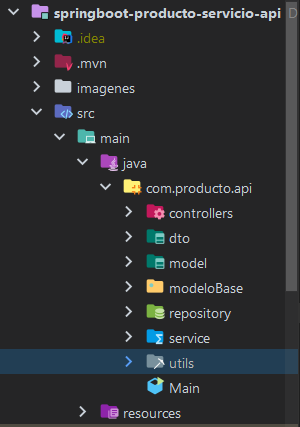
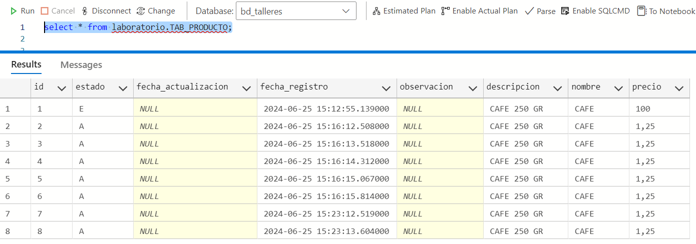

## 👉LABORATORIO API PRODUCTO 💪✔️

### 1. Descripción
El proyecto "CRUD PRODUCTO".

### 2. Características Principales
Este proyecto esta desarrollado bajo las siguientes herramientas:
- Spring boot versión: 3.2.3
- Java JDK versión:17
- Apache Maven  versió: 3.3.9
- Lombok
- BD SQLServer

### 3. Arquitectura

- Arquitectura - API



- tab_producto
  

#### 3.1. Model
- Models:
```
package com.producto.api.model;

import jakarta.persistence.Entity;
import java.io.Serializable;
import  com.producto.api.modeloBase.ModeloBaseEntidades;
import jakarta.persistence.*;

@Entity
@Table(name = "TAB_PRODUCTO" , schema = "laboratorio ")
public class TabProducto extends ModeloBaseEntidades<Long> implements Serializable {

	private static final long serialVersionUID = 1L;
	
	private String nombre;
	private String descripcion;
	private Double precio;

	@GeneratedValue(generator = "secTabProducto", strategy = GenerationType.SEQUENCE)
    @SequenceGenerator(name = "secTabProducto", allocationSize = 1, initialValue = 1, sequenceName = "SEC_TAB_PRODUCTO")
    @Id
    @Column(name = "ID")
    public Long getId() {
        return this.id;
    }

    public void setId(Long id) {
        this.id = id;
    }
    

	/**
	 * @return the nombreProducto
	 */
    @Column(name = "NOMBRE")
	public String getNombre() {
		return nombre;
	}


	public void setNombre(String nombre) {
		this.nombre = nombre;
	}

	/**
	 * @return the serialversionuid
	 */
	public static long getSerialversionuid() {
		return serialVersionUID;
	}

	/**
	 * @return the descripcion
	 */
	 @Column(name = "DESCRIPCION")
	public String getDescripcion() {
		return descripcion;
	}

	/**
	 * @param descripcion the descripcion to set
	 */
	public void setDescripcion(String descripcion) {
		this.descripcion = descripcion;
	}

	/**
	 * @return the precio
	 */
	@Column(name = "PRECIO")
	public Double getPrecio() {
		return precio;
	}

	/**
	 * @param precio the precio to set
	 */
	public void setPrecio(Double precio) {
		this.precio = precio;
	}
}
```
#### 3.2. Repository
- Repository:
```
package com.producto.api.repository;


import com.producto.api.model.TabProducto;
import org.springframework.data.jpa.repository.JpaRepository;
import org.springframework.data.jpa.repository.Query;
import org.springframework.data.repository.query.Param;
import org.springframework.stereotype.Repository;


import java.util.List;
import java.util.Optional;

@Repository
public interface TabProductoRepository extends JpaRepository<TabProducto, Long> {
	
	/** Nota:
	 Opcion 1: Podemos usar: Optional<TabProducto> findById(String id);
	 Opcion 2: Query:  @Query( "select u from where id = :id " )
	 */
	
	
	/** Consulta productos por Id */
    @Query( " select m.id " +
            ", m.nombre" +
            ", m.descripcion " +
            ", m.precio " +
            ", m.estado " +
            ", m.fechaResgistro " +
            " from TabProducto m where m.id = :id " )
    List<Object[]> consultaProductosPorId(@Param("id") Long id);

}

```

#### 3.3. Servicio
- Servicio:
```
package com.producto.api.service;

import com.producto.api.dto.ProductoDTO;
import com.producto.api.model.TabProducto;
import com.producto.api.repository.TabProductoRepository;
import org.springframework.beans.factory.annotation.Autowired;
import org.springframework.stereotype.Service;
import java.util.Date;
import java.util.List;
import java.util.stream.Collectors;

@Service
public class TabProductoServicio {

	@Autowired
	private TabProductoRepository tabProductoRepository;

	/** Registra */
	public void registrar(TabProducto productos) {
		tabProductoRepository.save(productos);
	}

	
	/** Devuelve lista todos los productos */
	 public List<ProductoDTO> findAll() {
	        List<TabProducto> resultObj =  tabProductoRepository.findAll();
	        return convertirProductoDTOAll(resultObj);
	    }
	
	 
	 /** Devuelve lista productos por Id */
	    public List<ProductoDTO> consultaProductosPorId(Long id) {
	        List<Object[]> resultObj = tabProductoRepository.consultaProductosPorId(id);
	        return convertirProductoDTOPorId(resultObj);
	    }
	    
	    
	    /** Actualiza producto por Id */
	    public void actualizarProducto(TabProducto producto){
			 tabProductoRepository.save(producto);
	    }

		/** Eliminar */
	public void deleteProducto(TabProducto producto){
		tabProductoRepository.save(producto);
	}
	    
	    
	    /** Metodos mapeo DTO para consultas */
	 public List<ProductoDTO> convertirProductoDTOAll(List<TabProducto> resultObj) {
	        return resultObj.stream().map(lData -> {
	        	ProductoDTO productoDTO = new ProductoDTO();
	        	productoDTO.setId(lData.getId());
	        	productoDTO.setNombre(lData.getNombre().trim());
	        	productoDTO.setDescripcion(lData.getDescripcion().trim());
	        	productoDTO.setPrecio(lData.getPrecio());
	        	productoDTO.setEstado(lData.getEstado().trim());
	        	productoDTO.setFechaRegistro(lData.getFechaResgistro());
	            return productoDTO;
	        }).collect(Collectors.toList());
	    }


	 /** Combierte de List<Object[]> a productoDTO */
	 public List<ProductoDTO> convertirProductoDTOPorId(List<Object[]> resultObj) {
	        return resultObj.stream().map(lData -> {
	        	ProductoDTO productoDTO = new ProductoDTO();
	        	productoDTO.setId(Long.parseLong(lData[0].toString()));
	        	productoDTO.setNombre(lData[1].toString());
	        	productoDTO.setDescripcion(lData[2].toString());
				productoDTO.setPrecio(Double.parseDouble(lData[3].toString()));
	        	productoDTO.setEstado(lData[4].toString());
	        	productoDTO.setFechaRegistro((Date) lData[5]);
	            return productoDTO;
	        }).collect(Collectors.toList());
	    }
	 
}
```

#### 3.4. Controllers
- Controllers:
```
package com.producto.api.controllers;

import com.producto.api.dto.ProductoDTO;
import com.producto.api.dto.ProductoRequestDTO;
import com.producto.api.dto.ProductoResponseDTO;
import com.producto.api.model.TabProducto;
import com.producto.api.service.TabProductoServicio;
import com.producto.api.utils.Constantes;
import org.springframework.beans.factory.annotation.Autowired;
import org.springframework.http.ResponseEntity;
import org.springframework.validation.annotation.Validated;
import org.springframework.web.bind.annotation.*;

import java.util.Date;
import java.util.List;

@RestController
@RequestMapping("/api/v1/mantenimiento/producto-service")
public class TabProductoController {

	@Autowired
	private TabProductoServicio tabProductoServicio;

	/**
	 * Registra prodcucto
	 */
	/** URL: http://localhost:8080/api/v1/mantenimiento/producto-service/registrar */
	/** { "nombre":"CAFE", "descripcion":"CAFE 250 GR", "precio":"1.25", "observacion":"NUEVO REGISTRO"} */
	@PostMapping("/registrar")
	public ResponseEntity<ProductoResponseDTO> registraProducto(@Validated @RequestBody ProductoRequestDTO request) {
		ProductoResponseDTO productoResponseDTO = new ProductoResponseDTO();
		TabProducto producto = new TabProducto();

		try {
			producto.setNombre(request.getNombre().toString().trim());
			producto.setDescripcion(request.getDescripcion().toString().trim());
			producto.setPrecio(request.getPrecio());
			producto.setEstado(Constantes.ACTIVO);
			producto.setFechaResgistro(new Date());
			tabProductoServicio.registrar(producto);

			productoResponseDTO.setMensaje(Constantes.TRANSACCION_EXITOSA);
			return ResponseEntity.ok(productoResponseDTO);

		} catch (Exception e) {
			System.out.println("ERROR: " + e.getStackTrace());
			productoResponseDTO.setMensaje(Constantes.ERROR_REGISTRAR);
			return ResponseEntity.status(500).body(productoResponseDTO);
		}
	}


	/**
	 * Consulta lista de productos
	 */
	/** URL: http://localhost:8080/api/v1/mantenimiento/producto-service/listadoProductos */
	@PostMapping("/listadoProductos")
	public ResponseEntity<ProductoResponseDTO> productosAll() {
		ProductoResponseDTO productoResponseDTO = new ProductoResponseDTO();

		try {
		List<ProductoDTO> listaProducto = tabProductoServicio.findAll();
		productoResponseDTO.setProducto(listaProducto);
		productoResponseDTO.setMensaje(Constantes.TRANSACCION_EXITOSA);
		return ResponseEntity.ok(productoResponseDTO);

	} catch (Exception e) {
		System.out.println("ERROR: " + e.getStackTrace());
		productoResponseDTO.setMensaje(Constantes.ERROR_LISTAR);
		return ResponseEntity.status(500).body(productoResponseDTO);
	 }
	}


	/**
	 * Actualizacion de producto por Id
	 */
	/** URL:  http://localhost:8080/api/v1/mantenimiento/producto-service/update */
	/** { "id":18, "precio":"100" } */
	@PutMapping("/update")
	public ResponseEntity<ProductoResponseDTO> updateProducto(@Validated @RequestBody ProductoRequestDTO request) {

		ProductoResponseDTO productoResponseDTO = new ProductoResponseDTO();

		try {
			List<ProductoDTO> resultProducto = tabProductoServicio.consultaProductosPorId(request.getId());

			if (resultProducto == null || resultProducto.isEmpty()) {
				productoResponseDTO.setMensaje(Constantes.REGISTRO_NO_ENCONTRADO);
				return ResponseEntity.status(404).body(productoResponseDTO);
			} else {
				TabProducto producto = new TabProducto();
				producto.setId(resultProducto.get(0).getId());
				producto.setEstado(resultProducto.get(0).getEstado());
				producto.setFechaResgistro(resultProducto.get(0).getFechaRegistro());
				producto.setDescripcion(resultProducto.get(0).getDescripcion());
				producto.setNombre(resultProducto.get(0).getNombre());

				/** Actulizo el precio */
				producto.setPrecio(request.getPrecio());

				tabProductoServicio.actualizarProducto(producto);
				productoResponseDTO.setMensaje(Constantes.TRANSACCION_EXITOSA);
				return ResponseEntity.ok(productoResponseDTO);
			}
		} catch (Exception e) {
			System.out.println("ERROR: " + e.getStackTrace());
			productoResponseDTO.setMensaje(Constantes.ERROR_ACTUALIZAR);
			return ResponseEntity.status(500).body(productoResponseDTO);
		}
	}


	/** Eliminacion de registro de forma logica */
	/** URL:  http://localhost:8080/api/v1/mantenimiento/producto-service/delete */
	/** { "id":28 } */
	@PutMapping("/delete")
	public ResponseEntity<ProductoResponseDTO> deleteProducto(@Validated @RequestBody ProductoRequestDTO request) {

		ProductoResponseDTO productoResponseDTO = new ProductoResponseDTO();

		try {
			List<ProductoDTO> resultProducto = tabProductoServicio.consultaProductosPorId(request.getId());

			if (resultProducto == null || resultProducto.isEmpty()) {
				productoResponseDTO.setMensaje(Constantes.REGISTRO_NO_ENCONTRADO);
				return ResponseEntity.status(404).body(productoResponseDTO);
			} else {
				TabProducto producto = new TabProducto();
				producto.setId(resultProducto.get(0).getId());
				producto.setFechaResgistro(resultProducto.get(0).getFechaRegistro());
				producto.setDescripcion(resultProducto.get(0).getDescripcion());
				producto.setNombre(resultProducto.get(0).getNombre());
				producto.setPrecio(resultProducto.get(0).getPrecio());
				producto.setEstado(Constantes.ELIMINADO);

				tabProductoServicio.deleteProducto(producto);
				productoResponseDTO.setMensaje(Constantes.TRANSACCION_EXITOSA);
				return ResponseEntity.ok(productoResponseDTO);
			}
		} catch (Exception e) {
			System.out.println("ERROR: " + e.getStackTrace());
			productoResponseDTO.setMensaje(Constantes.ERROR_ACTUALIZAR);
			return ResponseEntity.status(500).body(productoResponseDTO);
		}
	}
}

```

#### 3.5. Utils
- Utils:
```
package com.producto.api.utils;

public interface Constantes {

    public final static String ACTIVO = "A";
    public final static String INACTIVO = "I";
    public final static String ELIMINADO = "E";
    public final static String TRANSACCION_EXITOSA = "Transacción realizada con éxito";
    public static final String REGISTRO_NO_ENCONTRADO = "Producto no encontrado";

    public static final String ERROR_ACTUALIZAR = "ERROR: Ocurrio un error transaccion actualizar";

    public static final String ERROR_REGISTRAR = "ERROR: Ocurrio un error transaccion registrar";

    public static final String ERROR_LISTAR = "ERROR: Error en transaccion";
}

```

#### 3.6. DTO
- DTO's:
```
package com.producto.api.dto;

import java.util.Date;

public class ProductoDTO {
	
	    private Long id;
		private String nombre;
		private String descripcion;
		private Double precio;
	    private String estado;
	    private Date  fechaRegistro;
	    
	    public ProductoDTO (){}
	    
	    
	    
	    
		/**
		 * @param id
		 * @param nombre
		 * @param descripcion
		 * @param precio
		 * @param estado
		 * @param fechaRegistro
		 */
		public ProductoDTO(Long id, String nombre, String descripcion, Double precio, String estado,
				Date fechaRegistro) {
			this.id = id;
			this.nombre = nombre;
			this.descripcion = descripcion;
			this.precio = precio;
			this.estado = estado;
			this.fechaRegistro = fechaRegistro;
		}


		/**
		 * @return the id
		 */
		public Long getId() {
			return id;
		}
		/**
		 * @param id the id to set
		 */
		public void setId(Long id) {
			this.id = id;
		}
		/**
		 * @return the nombre
		 */
		public String getNombre() {
			return nombre;
		}
		/**
		 * @param nombre the nombre to set
		 */
		public void setNombre(String nombre) {
			this.nombre = nombre;
		}
		/**
		 * @return the descripcion
		 */
		public String getDescripcion() {
			return descripcion;
		}
		/**
		 * @param descripcion the descripcion to set
		 */
		public void setDescripcion(String descripcion) {
			this.descripcion = descripcion;
		}
		/**
		 * @return the precio
		 */
		public Double getPrecio() {
			return precio;
		}
		/**
		 * @param precio the precio to set
		 */
		public void setPrecio(Double precio) {
			this.precio = precio;
		}
		/**
		 * @return the estado
		 */
		public String getEstado() {
			return estado;
		}
		/**
		 * @param estado the estado to set
		 */
		public void setEstado(String estado) {
			this.estado = estado;
		}
		/**
		 * @return the fechaRegistro
		 */
		public Date getFechaRegistro() {
			return fechaRegistro;
		}
		/**
		 * @param fechaRegistro the fechaRegistro to set
		 */
		public void setFechaRegistro(Date fechaRegistro) {
			this.fechaRegistro = fechaRegistro;
		}
	    
	    
}

```

```
package com.empresa.api.dto;

import java.util.Date;

public class ProductoRequestDTO {

	private Long id;
    private String nombre;
	private String descripcion;
	private Double precio;
	private String estado;
	private String observacion;
	private Date fechaResgistro;
	private Date fechaActualizacion;
	
	
	public ProductoRequestDTO()
	{}
	
	
	
	/**
	 * @param id
	 * @param nombre
	 * @param descripcion
	 * @param precio
	 * @param estado
	 * @param observacion
	 * @param fechaResgistro
	 * @param fechaActualizacion
	 */
	public ProductoRequestDTO(Long id, String nombre, String descripcion, Double precio, String estado,
			String observacion, Date fechaResgistro, Date fechaActualizacion) {
		this.id = id;
		this.nombre = nombre;
		this.descripcion = descripcion;
		this.precio = precio;
		this.estado = estado;
		this.observacion = observacion;
		this.fechaResgistro = fechaResgistro;
		this.fechaActualizacion = fechaActualizacion;
	}
	/**
	 * @return the id
	 */
	public Long getId() {
		return id;
	}
	/**
	 * @param id the id to set
	 */
	public void setId(Long id) {
		this.id = id;
	}
	/**
	 * @return the nombre
	 */
	public String getNombre() {
		return nombre;
	}
	/**
	 * @param nombre the nombre to set
	 */
	public void setNombre(String nombre) {
		this.nombre = nombre;
	}
	/**
	 * @return the descripcion
	 */
	public String getDescripcion() {
		return descripcion;
	}
	/**
	 * @param descripcion the descripcion to set
	 */
	public void setDescripcion(String descripcion) {
		this.descripcion = descripcion;
	}
	/**
	 * @return the precio
	 */
	public Double getPrecio() {
		return precio;
	}
	/**
	 * @param precio the precio to set
	 */
	public void setPrecio(Double precio) {
		this.precio = precio;
	}
	/**
	 * @return the estado
	 */
	public String getEstado() {
		return estado;
	}
	/**
	 * @param estado the estado to set
	 */
	public void setEstado(String estado) {
		this.estado = estado;
	}
	/**
	 * @return the observacion
	 */
	public String getObservacion() {
		return observacion;
	}
	/**
	 * @param observacion the observacion to set
	 */
	public void setObservacion(String observacion) {
		this.observacion = observacion;
	}
	/**
	 * @return the fechaResgistro
	 */
	public Date getFechaResgistro() {
		return fechaResgistro;
	}
	/**
	 * @param fechaResgistro the fechaResgistro to set
	 */
	public void setFechaResgistro(Date fechaResgistro) {
		this.fechaResgistro = fechaResgistro;
	}
	/**
	 * @return the fechaActualizacion
	 */
	public Date getFechaActualizacion() {
		return fechaActualizacion;
	}
	/**
	 * @param fechaActualizacion the fechaActualizacion to set
	 */
	public void setFechaActualizacion(Date fechaActualizacion) {
		this.fechaActualizacion = fechaActualizacion;
	}
	

}

```

```
package com.producto.api.dto;
import java.util.List;
import com.producto.api.modeloBase.ResponseGenericoDTO;
import lombok.Getter;
import lombok.Setter;

@Getter
@Setter
public class ProductoResponseDTO extends ResponseGenericoDTO {
	
	private List<ProductoDTO> producto;

}

```

#### 3.7. ModeloBase
- Modelo Base:
```
package com.producto.api.modeloBase;

import jakarta.persistence.Column;
import jakarta.persistence.MappedSuperclass;
import jakarta.persistence.Temporal;
import jakarta.persistence.TemporalType;

import java.io.Serializable;
import java.util.Date;

@MappedSuperclass
public abstract class ModeloBaseEntidades <Id extends Serializable>{

	    protected Id id;
	    protected String estado;
	    protected String observacion;
	    protected Date fechaResgistro;
	    protected Date fechaActualizacion;


	    @Column(name = "FECHA_REGISTRO")
	    @Temporal(TemporalType.TIMESTAMP)
	    public Date getFechaResgistro() {
	        return fechaResgistro;
	    }

	    public void setFechaResgistro(Date fechaResgistro) {
	        this.fechaResgistro = fechaResgistro;
	    }


	    @Column(name = "ESTADO", length = 1)
	    public String getEstado() {
	        return estado;
	    }

	    public void setEstado(String estado) {
	        this.estado = estado;
	    }

	    @Column(name = "OBSERVACION")
	    public String getObservacion() {
	        return observacion;
	    }

	    public void setObservacion(String observacion) {
	        this.observacion = observacion;
	    }

	    @Column(name = "FECHA_ACTUALIZACION")
	    @Temporal(TemporalType.TIMESTAMP)
	    public Date getFechaActualizacion() {
	        return fechaActualizacion;
	    }

	    public void setFechaActualizacion(Date fechaActualizacion) {
	        this.fechaActualizacion = fechaActualizacion;
	    }
	}

```
```
package com.producto.api.modeloBase;

public class ResponseGenericoDTO {

	    private String idProccess;
	    private String ip;
	    private  String mensaje;
	    private String status;
	    
	    
	    
	    public ResponseGenericoDTO() {}
	    
		/**
		 * @param idProccess
		 * @param ip
		 * @param mensaje
		 * @param status
		 */
		public ResponseGenericoDTO(String idProccess, String ip, String mensaje, String status) {
			this.idProccess = idProccess;
			this.ip = ip;
			this.mensaje = mensaje;
			this.status = status;
		}
		
		
		/**
		 * @return the idProccess
		 */
		public String getIdProccess() {
			return idProccess;
		}
		/**
		 * @param idProccess the idProccess to set
		 */
		public void setIdProccess(String idProccess) {
			this.idProccess = idProccess;
		}
		/**
		 * @return the ip
		 */
		public String getIp() {
			return ip;
		}
		/**
		 * @param ip the ip to set
		 */
		public void setIp(String ip) {
			this.ip = ip;
		}
		/**
		 * @return the mensaje
		 */
		public String getMensaje() {
			return mensaje;
		}
		/**
		 * @param mensaje the mensaje to set
		 */
		public void setMensaje(String mensaje) {
			this.mensaje = mensaje;
		}
		/**
		 * @return the status
		 */
		public String getStatus() {
			return status;
		}
		/**
		 * @param status the status to set
		 */
		public void setStatus(String status) {
			this.status = status;
		}   
}

```

#### 3.8. application.properties
- application.properties:
```
spring.application.name=springboot-producto-servicio-api

# Conexion base datos
spring.datasource.url=jdbc:sqlserver://localhost:1433;databaseName=bd_talleres;encrypt=false;trustServerCertificate=false;loginTimeout=30;sslProtocol=TLSv1.2;
spring.datasource.username=sa
spring.datasource.password=admin*123
spring.datasource.driver-class-name=com.microsoft.sqlserver.jdbc.SQLServerDriver

# Visualizacion
spring.jpa.show-sql=true
spring.jpa.properties.hibernate.format_sql = false

# Hibernate ddl auto (create, create-drop, validate, update)
spring.jpa.hibernate.ddl-auto = update
```

### 4. EndPoints

- EndPont: registra-producto: http://localhost:8080/api/v1/mantenimiento/producto-service/registrar
    
  ```
    {
    "nombre":"CAFE",
    "descripcion":"CAFE 250 GR",
    "precio":"1.25",
    "observacion":"NUEVO REGISTRO"
    }
   ```
  
- EndPont: actualizar-producto: http://localhost:8080/api/v1/mantenimiento/producto-service/update

```
       {
       "id":18,
       "precio":"45.5"
      }
```

- EndPont: listado-productos: http://localhost:8080/api/v1/mantenimiento/producto-service/listadoProductos (No tiene request)


- EndPont: eliminar-producto:  http://localhost:8080/api/v1/mantenimiento/producto-service/delete

    ```
    {
        "id":18
    }
    ```

- 🚨🚧🔨🕜⛔Trabajando...
## Autor:
Leonardo Villagran | leviDev  
- [LinkedIn] https://www.linkedin.com/in/lvillagrans
